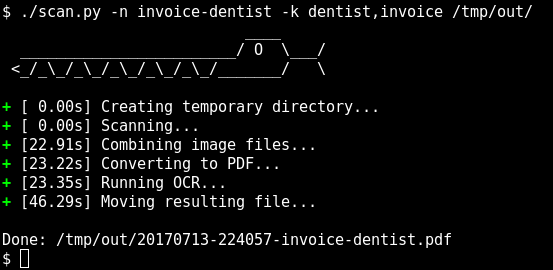

# pydigitize



## Features

pydigitize is a simple command-line based tool to scan/archive documents.

It does the following steps:

- Scan a document with any scanner that supports SANE (ADF supported)
- Straightening and cleaning of scanned documents
- Run OCR on PDF so that it becomes searchable
- Generate [PDF/A](https://en.wikipedia.org/wiki/PDF/a) file for archival
- Add keywords to the PDF file

Because you don't want to type the same arguments for every piece of paper that
you scan, pydigitize supports profiles: A profile pre-configures settings like
the output directory, the resolution, whether to run OCR, additional PDF
keywords, etc. You can create a profile for all your invoices for example. Then
every time you get an invoice, you scan it with `./scan.py -p invoice`, done.

## Requirements

- Python 3.x
- OCRmyPDF
- libtiff
- sane
- unpaper
- ghostscript

## Usage

See `./scan.py --help`.

## Profiles

If you want to use profiles, create a `profiles.toml` file in the current
directory.

For every profile you can specify the following parameters:

- `path`: The output directory
- `name`: Set a string that will be included in every filename in slugified form
- `ocr`: Whether to run OCR, straightening and cleanup on the scanned document
- `keywords`: List of keywords that will be added to PDF Metadata

You can also create sub-profiles. They inherit the settings from the parent.

Example:

```toml
[bill]
path = "/home/user/bills/"
name = "bill"
ocr = true
keywords = ["bill"]

[bill.dentist]
name = "dentist"
keywords = ["bill", "dentist"]

[drawing]
path = "/home/user/drawings/"
ocr = false
```

Then pass the name of the profile to the `scan.py` command using the `-p`
parameter.

    ./scan.py -p bill.dentist

You can of course override your parameters:

    ./scan.py -p bill -n amazon

## Interactive (Batch) Scanning

If you want to scan a specific number of pages, use the `-c` argument.

pydigitize will prompt you to confirm before scanning every page. This is very
useful for example when scanning double-sided documents on a scanner that does
not have a duplex unit, or when scanning a document partially in the ADF and
partially on the flatbed.

If you don't want manual confirmation, but just want the scanner to scan as
fast as it can, use the `--nowait` argument.

## License

Licensed under either of

 * Apache License, Version 2.0 ([LICENSE-APACHE](LICENSE-APACHE) or
   http://www.apache.org/licenses/LICENSE-2.0)
 * MIT license ([LICENSE-MIT](LICENSE-MIT) or
   http://opensource.org/licenses/MIT) at your option.

### Contribution

Unless you explicitly state otherwise, any contribution intentionally submitted
for inclusion in the work by you, as defined in the Apache-2.0 license, shall
be dual licensed as above, without any additional terms or conditions.
